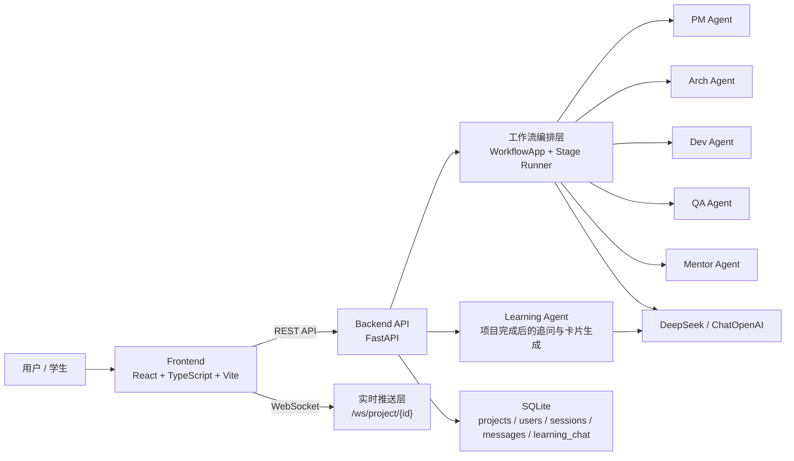
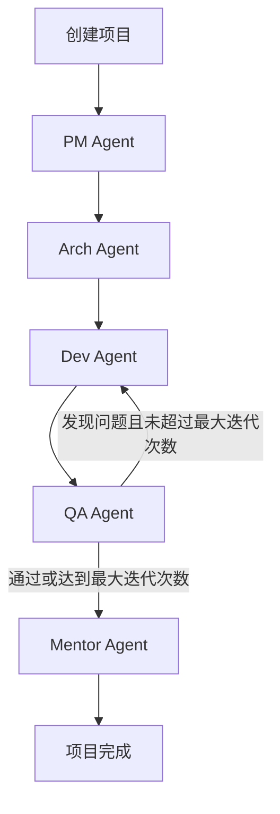

# SystemCraft 项目设计与技术架构说明

## 1. 项目概述

SystemCraft 是一个面向软件工程教学场景的多智能体协作平台。项目的核心目标不是单纯“生成一份答案”，而是把一个软件项目从需求理解、架构设计、实现、测试到复盘学习的全过程拆开展示给学习者，让学生在观察与参与中理解完整的软件工程链路。

从当前代码实现来看，SystemCraft 已经不是一个只有 Demo 的原型，而是一个具备前后端界面、账号体系、项目持久化、实时工作台、学习中心、成果展示和文档导出能力的教学型 Web 应用。

它的产品定位可以概括为三点：

1. 用多角色 AI 模拟真实软件团队的协作方式。
2. 用可视化工作台把“过程”而不是只把“结果”呈现出来。
3. 把最终输出沉淀为可复习、可展示、可导出的学习资产。

## 2. 设计目标

### 2.1 产品目标

- 让学生输入一句自然语言需求后，系统自动组织多智能体完成完整的软件工程流程。
- 让学习者看到每个阶段的职责边界、输入输出和阶段产物。
- 让项目完成后还能继续追问、做知识卡片、二次迭代和成果导出。
- 让教师或演示者可以把整个流程当作“软件工程教学演示平台”使用。

### 2.2 设计原则

- 过程显式化：每个阶段都有明确的角色、状态、消息流和产物。
- 学习导向：最终结果必须可解释、可复盘、可再次学习。
- 阶段可中断：生成流程支持暂停、恢复和二次迭代。
- 持久化优先：项目、消息、学习问答不依赖纯内存，支持重启后保留。
- 前后端分离：前端负责体验与呈现，后端负责流程编排、状态管理与存储。

## 3. 目标用户与使用场景

### 3.1 目标用户

- 计算机专业学生：用于课程作业、训练项目分析与复盘能力。
- 教师或助教：用于课堂展示软件工程流程与多角色协作。
- 独立开发者或学习者：用于快速获得结构化的软件设计样例。

### 3.2 核心使用场景

- 输入一句需求，自动生成需求文档、架构方案、代码产物、测试报告和导师总结。
- 在工作台中实时观察 PM、架构师、开发、QA、导师的协作过程。
- 在项目完成后继续向导师提问，并将回答沉淀为新的知识卡片。
- 对已完成项目发起新一轮变更迭代，观察需求变更如何影响后续产物。
- 导出 Markdown 文档或 HTML 展示页，用于提交作业、做课程展示或归档。

## 4. 核心需求分析

### 4.1 功能性需求

1. 用户需要注册、登录、维护个人资料，并且项目数据与账号绑定。
2. 用户需要创建项目，输入需求描述、选择难度和模板。
3. 系统需要按固定阶段驱动多智能体工作流。
4. 系统需要在运行过程中持续更新项目状态、进度和消息流。
5. 用户需要在工作台里查看流程图、消息流和阶段产物。
6. 系统需要允许用户暂停和恢复正在执行的流程。
7. 用户需要在项目完成后继续发起追问。
8. 系统需要把部分追问答案转化成新的知识卡片。
9. 用户需要对完成项目发起新一轮迭代请求。
10. 用户需要浏览、搜索、重命名和删除历史项目。
11. 用户需要在学习中心查看知识卡片、学习进度和导师问答。
12. 用户需要导出完整或部分项目文档，并生成可分享的展示页。

### 4.2 非功能性需求

- 可理解性：输出文本应结构化，便于教学展示与课程复用。
- 响应可感知：前端应展示实时进度、状态和消息流，减少黑盒感。
- 可恢复性：后端重启后，已保存项目应可恢复；运行中的项目应被标记为中断。
- 可维护性：多智能体角色、阶段元数据、页面结构和存储层要分模块组织。
- 可扩展性：后续可增加新 Agent、新模板、新导出格式、新学习机制。
- 本地部署友好：适合单机开发、课程演示和轻量部署。

## 5. 系统整体架构

SystemCraft 采用前后端分离架构，后端负责流程编排、状态持久化和接口暴露，前端负责页面交互、实时显示和学习资产组织。

### 5.1 分层说明

- 表现层：React 前端页面、工作台、学习中心、展示页、导出中心。
- 接口层：FastAPI 提供认证、项目管理、工作流控制和学习接口。
- 编排层：根据阶段元数据顺序执行多智能体节点，并处理 QA 回流。
- 智能体层：PM、Arch、Dev、QA、Mentor、Learning 六类角色。
- 存储层：SQLite 保存项目主数据、消息流、学习聊天与会话信息。

### 5.2 设计与实现之间的关系

README 将项目描述为“基于 LangGraph 的多智能体协作平台”，这一点在设计理念上成立，但当前主应用中的工作流实现并不是直接使用编译后的 LangGraph 图，而是通过自定义的 `WorkflowApp`、`run_stage()` 和 `get_next_stage()` 进行顺序编排与条件回流。

换句话说：

- 早期 Demo 仍然保留了 LangGraph `StateGraph` 的实验代码。
- 当前正式后端流程已经演进为一个更轻量、可控的自定义编排实现。

这意味着系统当前更偏向“LangGraph 思想驱动的教学工作流平台”，而不是“完全依赖 LangGraph 运行时的图执行器”。

## 6. 多智能体工作流设计

### 6.1 固定阶段

SystemCraft 当前采用 5 个主阶段：

1. `requirements_analysis`：PM Agent 产出结构化需求文档。
2. `architecture_design`：Arch Agent 产出技术架构方案。
3. `development`：Dev Agent 产出代码结构与实现说明。
4. `testing`：QA Agent 做测试与代码审查。
5. `mentor_review`：Mentor Agent 做复盘与知识卡片沉淀。

### 6.2 工作流流转规则

### 6.3 状态对象设计

所有 Agent 共用一个 `SystemCraftState`，其中包括：

- `user_input`、`difficulty`、`project_name`
- `requirements_doc`、`architecture_doc`、`code_artifacts`
- `test_report`、`mentor_notes`、`knowledge_cards`
- `current_stage`、`has_bugs`、`iteration_count`、`max_iterations`
- `agent_messages`

这一设计的优点是：

- 输入输出边界清楚，便于教学解释。
- 每个 Agent 只读取前序结果、写入自己的产物。
- 前端能直接将状态中的字段映射为可视化产物标签页。

### 6.4 QA 回流机制

QA Agent 是流程的关键控制点。其职责不仅是生成测试报告，还决定流程是否需要回到开发阶段。当前实现中：

- 第一次测试会更倾向于刻意找出 2 到 3 个问题，以演示“返工循环”。
- 若超过最大迭代次数，则自动放行，避免死循环。
- QA 结果会写入 `has_bugs` 与 `iteration_count`，由路由函数决定后续去向。

这个机制非常符合教学演示场景，因为它显式展示了“开发不是一次成型，而是测试驱动修正”的软件工程现实。

## 7. 后端架构设计

## 7.1 技术栈

- Python
- FastAPI
- WebSocket
- LangChain OpenAI 兼容客户端
- DeepSeek API
- SQLite
- python-dotenv
- Rich

## 7.2 模块划分

### `backend/main.py`

后端应用入口，职责包括：

- 启动前校验配置
- 创建 FastAPI 应用
- 配置 CORS
- 注册 REST 路由与 WebSocket 路由
- 提供 `/` 和 `/health` 基础探针

### `backend/config.py`

统一管理环境变量与 LLM 配置，主要负责：

- 读取 DeepSeek 相关配置
- 管理调试与超时参数
- 检查 API Key 是否存在且格式正确
- 创建 `ChatOpenAI` 兼容实例

### `backend/graph/`

当前项目的工作流核心模块。

- `state.py`：定义共享状态与消息对象
- `workflow.py`：维护阶段配置、阶段执行逻辑、下一阶段计算和兼容包装器

### `backend/agents/`

每个 Agent 都继承自 `BaseAgent`。基类统一封装：

- 模型调用
- 重试机制
- Rich 日志输出
- 标准消息结构

各角色职责如下：

- PM Agent：把自然语言需求整理为结构化需求文档
- Arch Agent：基于需求输出技术选型、模块划分、数据库与 API 方案
- Dev Agent：基于架构方案输出项目结构、核心代码与配置
- QA Agent：生成测试用例、代码审查结果与通过/失败结论
- Mentor Agent：总结学习过程并生成知识卡片
- Learning Agent：在项目完成后回答学生追问，并按需生成额外卡片

### `backend/api/routes.py`

这是后端最关键的业务入口，主要包含四大类能力：

1. 认证接口
2. 项目生命周期接口
3. 学习追问接口
4. 历史项目管理接口

### `backend/api/websocket.py`

负责按项目维度维护 WebSocket 连接池，实现：

- 基于 session token 的连接鉴权
- 向指定项目的前端页面广播状态更新
- 广播 Agent 消息流
- 前端心跳保活

### `backend/project_store.py`

这是项目的数据持久化中心，负责：

- 初始化 SQLite 表结构
- 账号注册、登录、密码哈希与会话管理
- 项目加载与保存
- Agent 消息与学习聊天持久化
- 从旧的 JSON 存储迁移到 SQLite

## 7.3 接口设计

### 认证接口

- `POST /api/auth/register`
- `POST /api/auth/login`
- `GET /api/auth/session`
- `PATCH /api/auth/profile`
- `POST /api/auth/change-password`
- `POST /api/auth/logout`

### 项目接口

- `POST /api/project`
- `GET /api/project/{project_id}`
- `PATCH /api/project/{project_id}`
- `POST /api/project/{project_id}/iterate`
- `POST /api/project/{project_id}/pause`
- `POST /api/project/{project_id}/resume`
- `DELETE /api/project/{project_id}`
- `GET /api/projects`

### 学习接口

- `POST /api/project/{project_id}/follow-up`
- `POST /api/project/{project_id}/learning-card`

### 实时接口

- `WS /ws/project/{project_id}?token=...`

## 7.4 项目运行状态设计

后端将项目状态定义为：

- `queued`
- `running`
- `pausing`
- `paused`
- `completed`
- `error`

这一状态机的价值在于：

- 前端可以准确呈现当前执行阶段与运行状态。
- 用户可以明确知道是“正在排队”“正在执行”“已暂停”还是“异常中断”。
- 若后端重启，原来运行中的项目会被自动标记为错误，避免前端误判。

## 7.5 并发与任务模型

项目创建后，后端会为每个项目启动一个异步任务来执行工作流。关键实现点包括：

- 使用 `asyncio.create_task()` 调度项目工作流
- 使用 `asyncio.to_thread()` 在后台线程里执行阻塞型模型调用
- 使用内存缓存保存当前运行项目
- 每个关键节点完成后持久化项目状态并广播更新

当前实现的一个重要策略是：同一用户同一时间只能有一个活动项目。这样可以降低资源竞争，也更符合教学产品的单任务工作流体验。

## 8. 数据存储设计

当前项目使用 SQLite 作为主存储，数据库文件位于 `backend/data/systemcraft.db`。

### 8.1 核心表

#### `users`

用于保存用户账号信息：

- `id`
- `name`
- `username`
- `password_hash`
- `password_salt`
- `created_at`
- `last_login_at`
- `is_legacy`

#### `sessions`

用于保存登录会话：

- `token`
- `user_id`
- `created_at`
- `expires_at`

#### `projects`

这是业务主表，保存项目的核心字段与阶段产物：

- 项目标识与所属用户
- 需求描述、难度、状态、阶段
- 需求文档、架构方案、代码产物、测试报告、导师总结、知识卡片
- 进度文本与百分比
- 下一阶段与状态 JSON
- 完整载荷 JSON

#### `agent_messages`

用于持久化每个阶段的消息流，支持工作台回放。

#### `learning_chat`

用于保存项目完成后的学习追问、导师回答和是否已加入知识卡片的状态。

### 8.2 存储设计特点

- 兼容演进：保留 `payload_json` 与 `state_json`，方便未来扩展字段。
- 消息可重放：Agent 输出与学习聊天不只存在于内存。
- 兼容旧版本：支持从 `projects.json` 迁移到 SQLite。
- 本地优先：适合教学 Demo 和单机演示，但暂不适合多实例分布式部署。

## 9. 前端架构设计

## 9.1 技术栈

- React 18
- TypeScript
- Vite
- Tailwind CSS
- Framer Motion
- React Router
- React Markdown
- ReactFlow

## 9.2 路由结构

前端主路由包括：

- `/`：首页，创建项目
- `/projects`：项目管理页
- `/settings`：账号设置页
- `/guide`：项目介绍页
- `/workbench/:projectId`：工作台
- `/showcase/:projectId`：成果展示页
- `/learn`：学习中心
- `/export`：导出中心

未登录用户会被引导进入认证页。

## 9.3 页面能力设计

### 首页 HomePage

首页是最轻量的创建入口，提供：

- 一句话需求输入
- 项目模板选择
- 难度选择
- 最近项目回访入口
- 当前活动项目提示

其设计目标是让用户“几乎零门槛地发起一个工程项目工作流”。

### 工作台 WorkbenchPage

工作台是产品核心页面，采用三栏结构：

1. AI 工作流程图
2. 协作消息流
3. 产物预览

它还提供：

- 实时 WebSocket 状态同步
- 进度条与阶段状态展示
- 暂停 / 恢复控制
- 二次迭代入口
- 可伸缩与可聚焦的大面板交互
- 追踪矩阵展示

这使得用户既能看到“流程走到哪里”，也能看到“每一步产出了什么”。

### 项目管理页 ProjectsPage

提供项目级管理能力：

- 搜索
- 状态筛选
- 自动刷新
- 重命名
- 删除
- 快速进入工作台或成果展示页

### 学习中心 LearnPage

学习中心围绕 `LearningDeck` 组件构建，能力包括：

- 知识卡片浏览
- 思考题训练
- 学习进度记录
- 阶段掌握度可视化
- 项目完成后的导师追问
- 将回答加入知识卡片

这是 SystemCraft 与普通“代码生成器”最大的差异化模块之一。

### 成果展示页 ShowcasePage

成果展示页更偏向“对外展示”和“项目汇报”：

- 汇总关键产物与知识卡片
- 展示追踪矩阵
- 展示迭代历史
- 支持复制分享摘要
- 支持导出 HTML 展示页或完整文档

### 导出中心 ExportPage

导出中心支持：

- 选择最近项目
- 选择导出哪些产物模块
- 导出完整 Markdown Bundle
- 导出部分文档
- 生成适合分享的 HTML 页面

### 设置页 SettingsPage

用于维护：

- 显示名称
- 用户名
- 密码

### 认证页 AuthPage

提供登录与注册模式切换，并说明当前使用本地 SQLite 进行账户和密码哈希存储。

## 9.4 前端公共能力

### 会话管理

`UserSessionProvider` 负责：

- 持久化 session token
- 启动时恢复会话
- 登录 / 注册后更新用户态
- 登出后清空本地状态

### 阶段元数据

前端通过 `stage.ts` 统一维护：

- 阶段 ID
- 角色
- 显示名称
- 简介
- 关联产物 key
- 颜色

这保证了流程图、状态标签和产物切换能够使用同一套元数据。

### 追踪矩阵

`traceability.ts` 会从需求、架构、实现、测试的 Markdown 内容中提取标题、列表或段落，构造“需求 -> 架构 -> 实现 -> 测试”的追踪行。虽然当前是启发式抽取，不是严格的语义级映射，但已经能提供比较直观的教学视图。

## 10. 关键业务流程

### 10.1 项目创建流程

1. 用户在首页输入需求、选择难度和模板。
2. 前端调用 `POST /api/project`。
3. 后端创建初始项目对象与状态。
4. 后端立即启动异步工作流任务。
5. 前端跳转工作台并通过 WebSocket 接收实时状态。

### 10.2 工作流执行流程

1. 后端按阶段设置进度和状态说明。
2. 阶段开始消息写入项目消息流。
3. Agent 调用大模型生成结果。
4. 结果写入状态对象和项目持久化存储。
5. 新消息和新状态通过 WebSocket 推送到前端。
6. QA 阶段根据结果决定是否返工。
7. Mentor 阶段完成后项目状态变为 `completed`。

### 10.3 学习追问流程

1. 用户在学习中心输入问题。
2. 后端调用 `LearningAgent`，结合项目全部上下文生成导师回答。
3. 回答写入 `learning_chat`。
4. 若用户选择沉淀，系统把回答转化为新的知识卡片并追加到 `knowledge_cards`。

### 10.4 二次迭代流程

1. 用户只能对已完成项目发起迭代。
2. 后端会把变更请求和当前项目快照记录到 `iteration_history`。
3. 系统以“原需求 + 当前成果 + 新变更请求”重建新的初始输入。
4. 工作流重新从 PM 阶段开始推进。

## 11. 技术实现亮点

### 11.1 把“过程可视化”作为一等能力

很多 AI 产品只给最终结果，而 SystemCraft 在页面结构、消息模型、阶段元数据和 WebSocket 推送层面都围绕“过程可见”展开，这对教学场景非常关键。

### 11.2 学习闭环完整

项目不是在 Mentor 输出后结束，而是继续延伸到：

- 知识卡片
- 思考题
- 学习进度
- 跟问问答
- 卡片追加沉淀

这让系统从“生成工具”升级为“学习平台”。

### 11.3 持久化比 README 展示的更成熟

README 中仍保留较早的阶段描述，但当前代码已经具备：

- 账号系统
- SQLite 持久化
- 历史项目管理
- 学习聊天持久化
- 迁移旧数据

说明项目已从早期实验版向完整应用形态推进。

### 11.4 导出与展示能力很完整

系统不仅能导出 Markdown Bundle，还能生成独立 HTML 展示页，适合课程汇报、项目归档和分享传播。

## 12. 当前架构的限制与风险

### 12.1 编排层仍偏顺序执行

当前工作流是串行阶段推进，没有真正实现并行 Agent 协作，因此更适合教学解释，不适合高吞吐生产型多 Agent 平台。

### 12.2 LLM 结果高度依赖 Prompt

各 Agent 的输出高度依赖 Prompt 模板，当前没有引入结构化输出校验、模式约束或自动评估机制，可能出现内容风格不稳定的问题。

### 12.3 CORS 与安全策略偏开发态

后端当前允许 `allow_origins=["*"]`，更适合本地开发和演示，不适合直接上线到公网。

### 12.4 本地 SQLite 不适合多实例扩展

当前持久化适合单机和教学 Demo，但不适合横向扩展、团队协作或云端多副本部署。

### 12.5 追踪矩阵是启发式构造

它对教学展示已经有价值，但尚未做到真正语义级的需求追踪与覆盖率验证。

### 12.6 Agent 输出仍以 Markdown 文本为主

当前所有阶段产物主要以 Markdown 字符串形式保存，优点是简单易展示，缺点是结构化程度有限，不利于更复杂的下游自动处理。

## 13. 适合的演进方向

### 13.1 架构层演进

- 将当前自定义工作流进一步升级为显式图结构执行器
- 支持更多条件分支与更细粒度节点
- 将阶段输出改造为结构化 JSON + Markdown 双轨存储

### 13.2 模型层演进

- 为不同 Agent 使用更明确的结构化输出约束
- 引入自动质量评分与输出回收机制
- 引入更丰富的提示模板和教学风格配置

### 13.3 产品层演进

- 增加教师视角和课堂模式
- 增加团队协作、项目分享和评论能力
- 增加课程模板、作业模板和评分 Rubric

### 13.4 数据层演进

- 将 SQLite 升级为 PostgreSQL
- 将会话、消息、项目产物做更细粒度的对象化存储
- 引入审计日志和任务执行记录

## 14. 运行与开发方式

### 14.1 后端启动

项目根目录提供 `start-backend.cmd`，其流程为：

1. 检查 Python 是否存在
2. 自动创建 `.venv`
3. 自动安装依赖
4. 启动 `python main.py`

### 14.2 前端启动

项目根目录提供 `start-frontend.cmd`，其流程为：

1. 检查 `npm`
2. 如无 `node_modules` 则自动安装依赖
3. 运行 `npm run dev`

### 14.3 一键联动启动

`start-systemcraft.cmd` 会同时打开前后端命令窗口，适合本地教学演示。

### 14.4 环境变量

后端依赖以下关键环境变量：

- `DEEPSEEK_API_KEY`
- `DEEPSEEK_BASE_URL`
- `DEEPSEEK_MODEL`
- `DEBUG`
- `MAX_ITERATIONS`

## 15. 项目总结

SystemCraft 的本质不是“多智能体帮你写项目”，而是“多智能体把软件工程过程教给你看”。它在当前代码中已经形成了比较完整的产品闭环：

- 用项目模板和难度控制降低创建门槛
- 用多阶段工作流显式展示软件工程链路
- 用工作台和消息流提升过程透明度
- 用持久化与项目管理保障连续使用
- 用学习中心、知识卡片和追问机制形成学习闭环
- 用导出与展示页支持课程交付和成果传播

如果把它作为教学型 AI 产品来看，当前架构已经具备较强的可演示性和可扩展性；如果要继续向生产级平台演进，则需要进一步加强结构化输出、编排灵活度、安全策略和数据库扩展能力。
